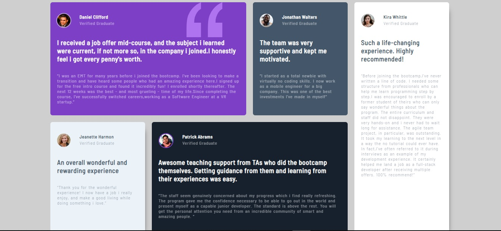

# # Frontend Mentor - Testimonials grid section solution

This is a solution to the [Testimonials grid section challenge on Frontend Mentor](https://www.frontendmentor.io/challenges/testimonials-grid-section-Nnw6J7Un7). Frontend Mentor challenges help you improve your coding skills by building realistic projects.

## Table of contents

- [Overview](#overview)
  - [The challenge](#the-challenge)
  - [Screenshot](#screenshot)
  - [Links](#links)
- [My process](#my-process)
  - [Built with](#built-with)
  - [What I learned](#what-i-learned)
  - [Continued development](#continued-development)
  - [Useful resources](#useful-resources)
- [Author](#author)

## Overview

### The challenge

Users should be able to:

- View the optimal layout for the site depending on their device's screen size

### Screenshot

### Links

- Solution URL: (https://www.frontendmentor.io/solutions/responsive-css-grid-template-Ao9fRjYjip)
- Live Site URL: (https://ahmed7019.github.io/Testimonials-grid_section/)

## My process

### Built with

- Semantic HTML5 markup
- CSS custom properties
- Flexbox
- CSS Grid

### What I learned

    Practicing grid and flexbox is the most thing i worked with and had obstacles with in this challenge . And while solving the problems i got familiar with the syntaxes and working with columns and rows .

### Continued development

    I will continue practicing grid and i will work with more complicated templates of grid to master it .

### Useful resources

- (https://youtu.be/rg7Fvvl3taU?si=SP9TurlGvjkTCcAV) - This taught me tricks to use in grid and it was really helpful .

## Author

- Frontend Mentor [@A7med7019] (https://www.frontendmentor.io/profile/Ahmed7019) .
